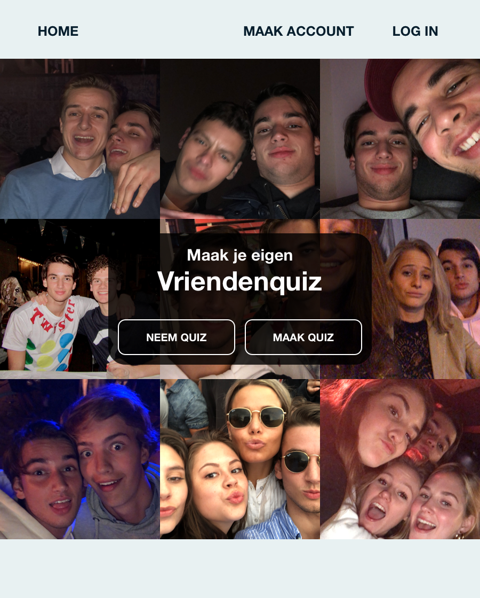
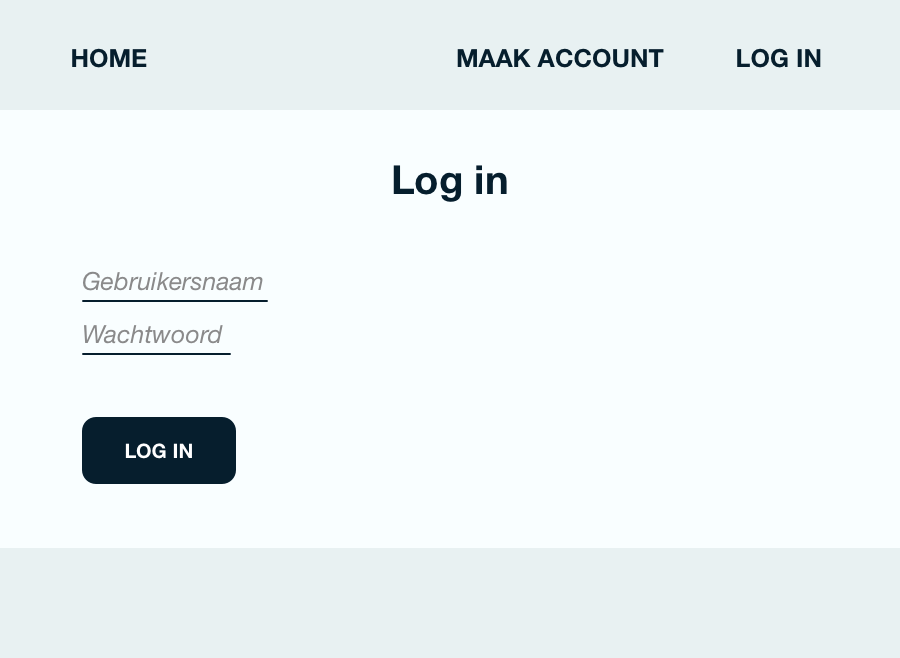
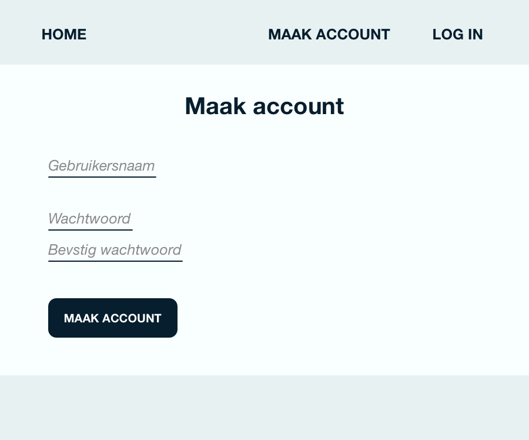
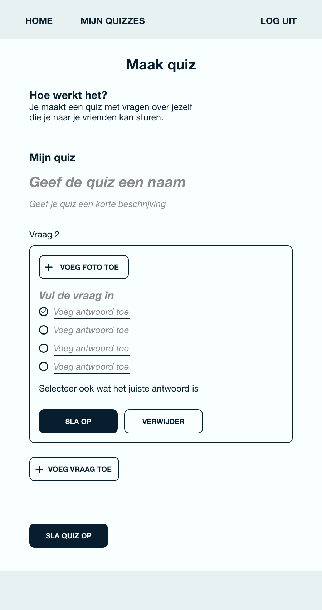
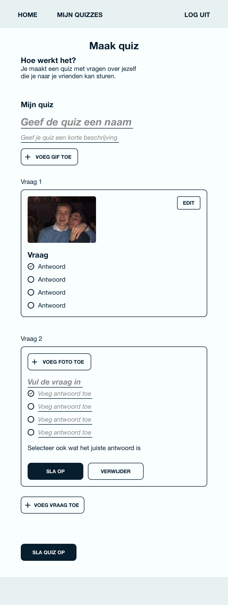
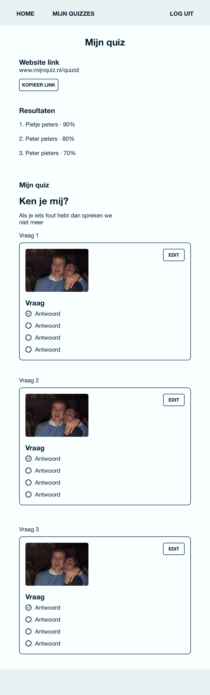
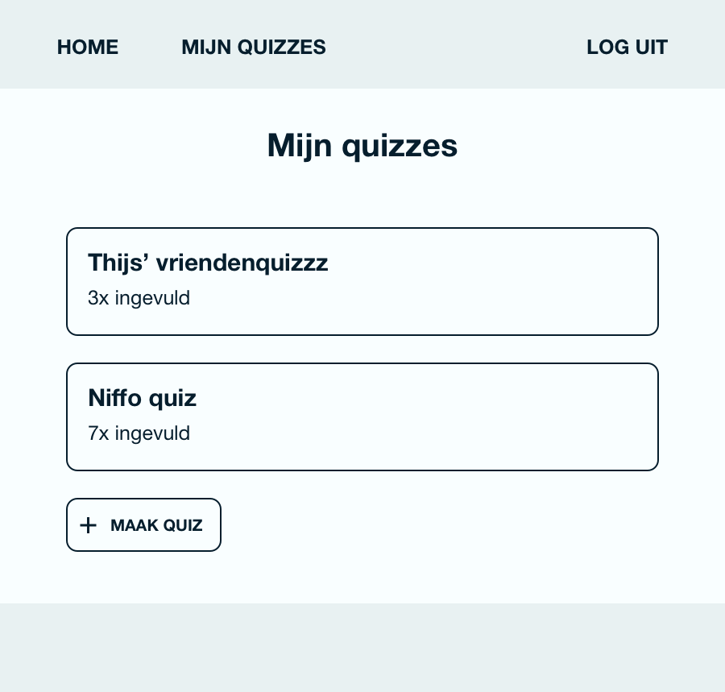

Namen: Rik, Yannick & Mijntje   
Cursustitel: Webprogrammeren en databases  
Opdracht: Technisch ontwerp  
Groep: IK12  
Datum: 14/1/12

# Technisch ontwerp

## Controllers

Het is de bedoeling dat gebruikers van deze webapplicatie in staat worden gesteld om een quiz met zelfbedachte vragen op basis van door hen geüploade foto’s te creëren. Om een quiz aan te maken is het vereist dat gebruikers zich registreren; op hun persoonlijke accountpagina staan alle quizzes die deze gebruiker heeft aangemaakt weergegeven. Bij elke quiz staat er natuurlijk ook een link waarmee gebruikers de quiz  deze met hun vrienden te delen. Via deze link kunnen hun vrienden deze quiz vervolgens invullen, zonder hiervoor zelf een account aan te hoeven maken. Ten slotte dient iedereen de resultaten van de quiz in kwestie in te kunnen zien door doorverwezen te worden naar een publieke resultatenpagina. Om dit mogelijk te maken zijn de volgende webroutes van cruciaal belang;

1. /home
1. /registreren
1. /inloggen
1. /mijnquizzes
* alle quizzes met link om te delen
1. /quizaanmaken
* titel en GIF, vragen en bijbehorende antwoorden, foto’s uploaden
1. /quizinvullen
1. /resultaten

## Views

## Models
* Apology scherm
* Functie die GIFs ophaalt van de API
* Login vereist functie

## Plugins en frameworks
* Bootstrap
