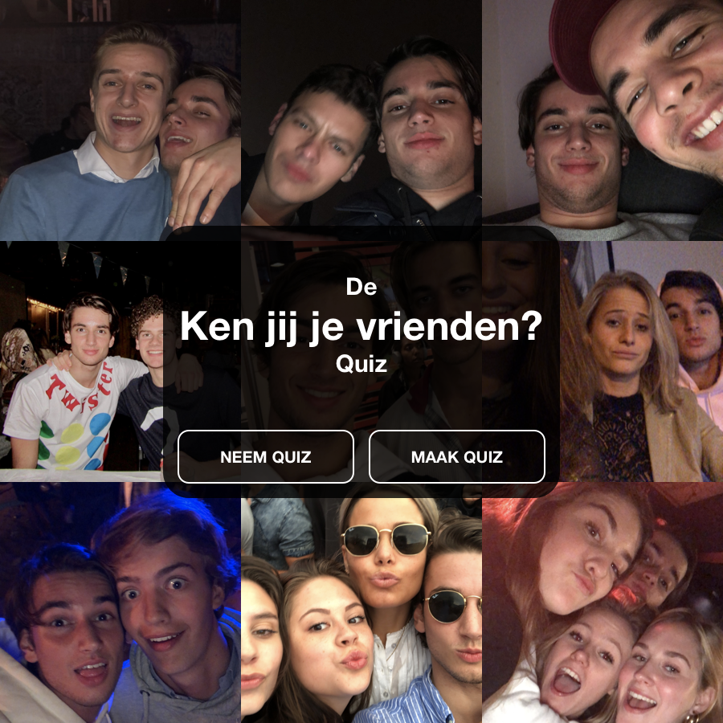
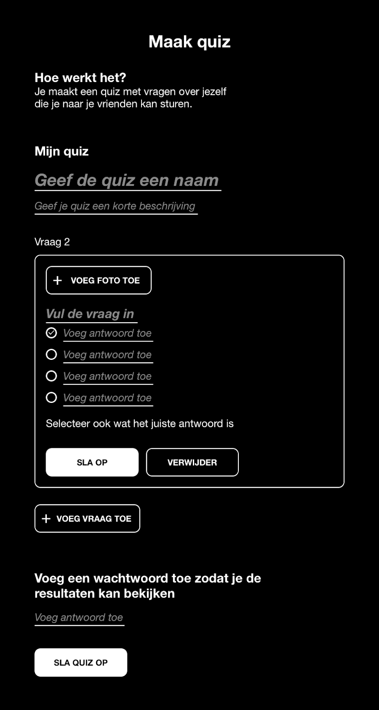
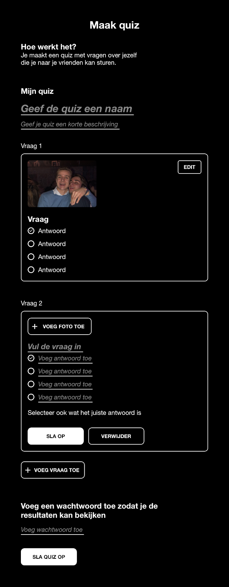
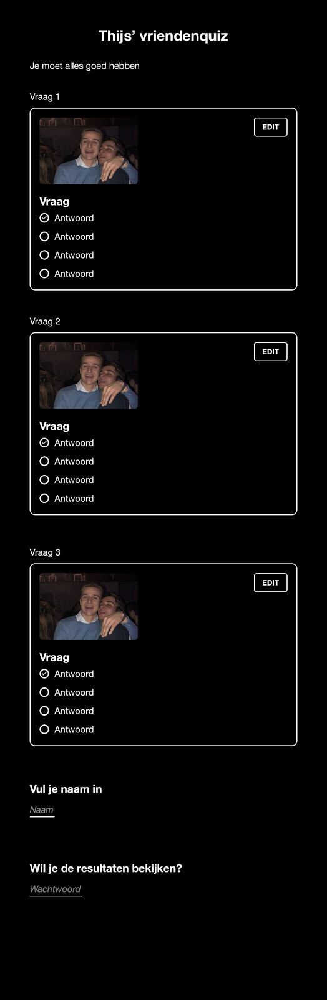
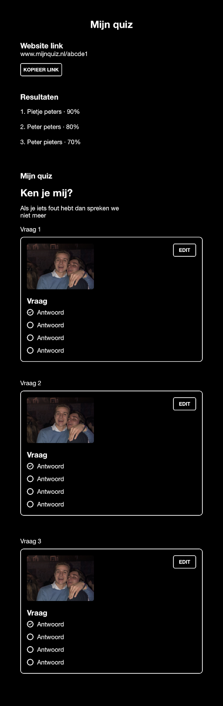

Namen: Rik, Thijs, Yannick & Mijntje  
Cursustitel: Webprogrammeren en databases  
Opdracht: Voorstel webapplicatie  
Groep: IK12  
Datum: 10/1/12

# Projectvoorstel

## Samenvatting

Er is niets uniekers dan jijzelf. Met onze webapplicatie maak je een quiz over jezelf en deel je deze met je vrienden. Wie weet het meest en is jouw beste vriend? En wat is nou een betere manier om de kennis van je vrienden te meten dan een foto? *After all, a picture says a thousand words…* Wie beantwoord de meeste vragen goed binnen jouw vriendengroep en is de **BESTE VRIEND**?

## Schetsen

## Features
1. Account aanmaken om quizzes in op te slaan
1. Nieuwe quiz aanmaken door foto's te uploaden en hier vragen (en eventueel tips) bij te schrijven
1. De mogelijkheid om GIFs toe te voegen aan de quiz
1. Wachtwoord/pincode toevoegen aan quiz
1. De quiz delen (via Facebook/email/link o.i.d.)
1. De quiz doen
1. Flash/finale-ronde met tijdsdruk als optie
1. Tips ontvangen tijdens de quiz als optie
1. Beschrijving toevoegen aan de vraag
1. De scorelijsten inzien met het wachtwoord/de pincode
1. Inzien welke vrienden welke vragen fout hadden
1. De scorelijsten delen (via Facebook/email/link o.i.d.)

## Minimum viable product features
1. Quiz creëren door foto's te uploaden en hierbij passende vragen en antwoorden in te voeren
1. Quiz maken
1. GIFs toevoegen
1. Scorelijsten inzien: wie heeft de meeste vragen goed?

## Afhankelijkheden
Databronnen:
* Giphy API
* Eigen database-structuur (SQLite): tables voor (1) quiz-creators, (2) de quizvragen en -antwoorden & (3) de resultaten

Externe componenten:
* Documentatie HTML, CSS, JavaScript & SQL
* SQL-bibliotheek tijdens coderen
* Flask-framework bibliotheek tijdens coderen
* Bootstrap
* Facebook integreren  (https://developers.facebook.com/docs/sharing/web/)

Opmerkelijke punten concurrerende websites:
* Allereerst zijn er niet heel veel online vriendenquizzes te vinden die gebruikers toestaan een quiz over zichzelf te creëren
* De interfaces van de meeste online vriendenquizzes zien er erg schreeuwerig, ouderwets en/of kinderlijk uit
* Slechts een paar quizzes hebben de mogelijkheid echt zélf de vragen en antwoorden in te typen
* In geen enkele andere quiz worden vragen gesteld op basis van foto’s

Moeilijkste punten realisatie applicatie:
* Uitzoeken hoe de database-structuur van de quiz ingedeeld gaat worden
* De opgehaalde data (GIFs) integreren in de quiz
* Een consistente en flowende user experience bewerkstelligen

